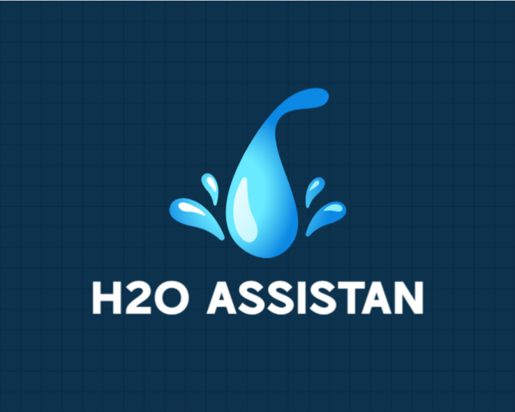
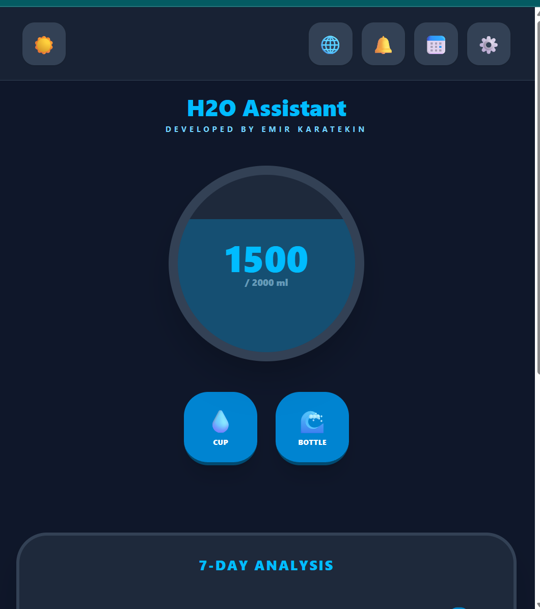
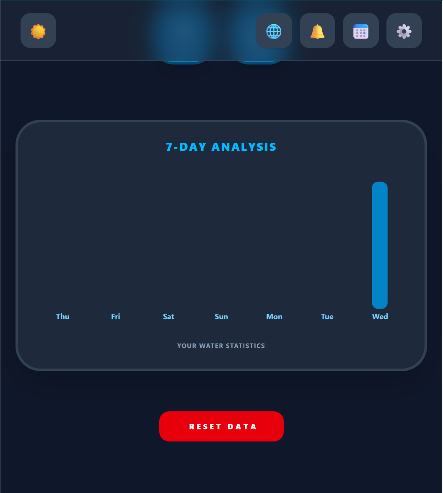
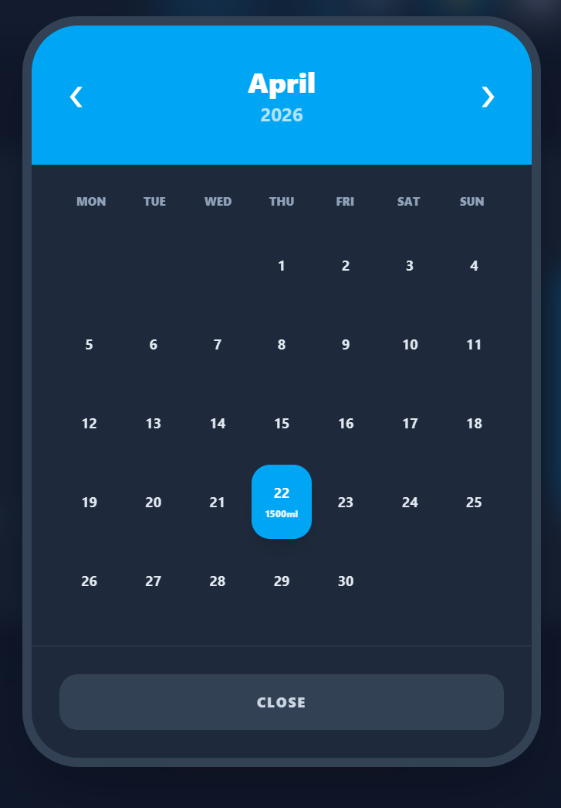
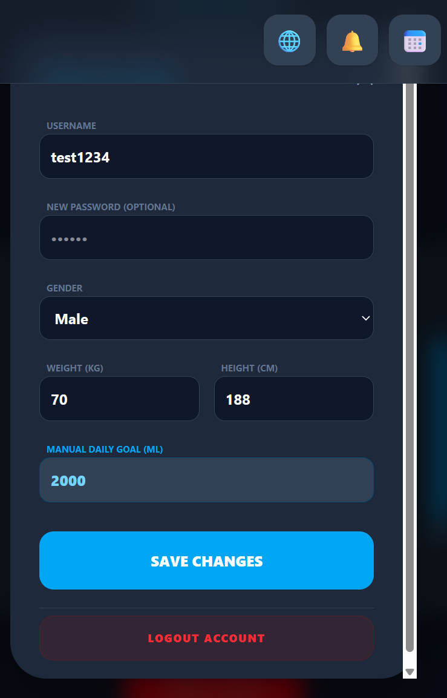
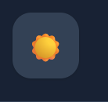
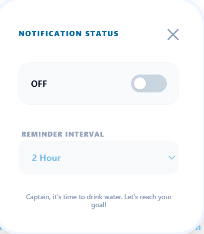
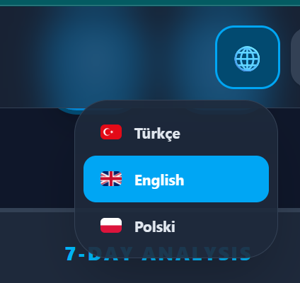

# 💧 Water Intake Reminder (SuVakti) - PWA Project

[](https://reactjs.org/)
[](https://nodejs.org/)
[](https://www.mongodb.com/)
[](https://web.dev/progressive-web-apps/)

**Institution:** VIZJA University
**Developer:** Emir Karatekin
**Term:** Spring 2026

---

<p align="center">
  
</p>

## 🚀 Project Overview

**H2O Assistant (SuVakti)** is a full-stack Progressive Web Application (PWA) designed to track daily hydration. It bridges the gap between web and mobile by offering an installable interface, offline capabilities, and multi-language support (TR/EN/PL).

Developed end-to-end, this project encompasses full-stack architecture, UI/UX design (Tailwind CSS), and dynamic localization.

### ✨ Core Features

- **Smart Calculation:** Automatically sets daily goals based on user weight (Weight × 35ml).
- **Gamification:** Celebrate daily goal achievement with confetti effects and haptic feedback.
- **Data Visualization:** Interactive 7-day analysis charts and a detailed monthly calendar view.
- **Dynamic Localization:** Full support for Turkish, English, and Polish.
- **PWA Integration:** Add to Home Screen (A2HS) support with custom manifests and service workers.
- **Timezone Sync:** Localized date handling ensuring logs are synced to the user's specific timezone.
- **Dark Mode:** Full dark theme support across the entire app.
- **Notifications:** Configurable reminder notifications to keep users on track.

---

## 📸 Screenshots

| Home Screen | 7-Day Analysis |
|:---:|:---:|
|  |  |

| Calendar View | Profile & Settings |
|:---:|:---:|
|  |  |

| Dark Mode | Notifications |
|:---:|:---:|
|  |  |

| Language Selector | App Settings |
|:---:|:---:|
|  |  |

---

## ⚙️ System Architecture (How it Works)

The project follows the **MERN Stack** architecture:

1.  **Frontend (React.js):** A single-page application (SPA) built with Vite. It handles the UI logic, state management (using Hooks), and localized translations. It communicates with the backend via **Axios**.
2.  **Backend (Node.js & Express):** A RESTful API that handles user authentication (JWT), water log CRUD operations, and profile management.
3.  **Database (MongoDB Atlas):** A cloud-based NoSQL database storing user profiles and water consumption history with timestamps.
4.  **PWA Logic:** A `manifest.json` and Service Worker allow the app to be installed on mobile devices and provide basic offline caching for assets.

---

## 🛠 Installation & Setup

To ensure security and performance, `node_modules` and `.env` files are not included in this repository. Follow the steps below to set up the project locally:

### 1. Prerequisites

- **Node.js** (v18+)
- **MongoDB Atlas** account

### 2. Backend Setup (Server)

Go to the server directory, install dependencies, and create your environment file:

```bash
cd server
npm install
# Create a .env file and add your credentials:
# PORT=5000
# MONGO_URI=your_mongodb_connection_string
# JWT_SECRET=your_secret_key
npm start
```

### 3. Frontend Setup (Client)

Open a new terminal, go to the client directory, and install dependencies:

```bash
cd client
npm install
npm run dev
```

The app should now be running locally. Open the URL shown in your terminal (typically `http://localhost:5173`) in your browser.

---

## 📄 License

This project was developed as part of the Spring 2026 term at VIZJA University.
